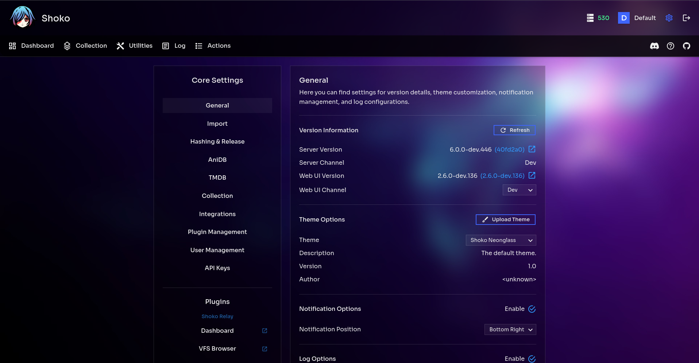

# Neonglass for Shoko WebUI

A faithful adaptation of the **Neonglass** theme, originally built for Unraid by
[tenasi](https://github.com/tenasi/unraid-neonglass) (inspired by @zisen).

Faux-glass, not real glassmorphism: a fixed abstract background photo with
translucent black panels over it — no blur, no `backdrop-filter`, exactly like
the original. Sharp corners everywhere, hairline white borders, neon blue
accents (`#3F65FB`), outline-style buttons that fill with a glow on hover, and
the signature hue-cycling logo in the header. Dark only.

## Install

Drop both files into your Shoko Server themes folder:

- **Windows:** `C:\ProgramData\ShokoServer\themes`
- **Linux:** `~/.shoko/Shoko.CLI/themes`

Or upload via the WebUI: **Settings → General → Theme Options → Upload Theme**.

Then select **Neonglass** in the theme dropdown on the same settings page and
click **Save**.

The theme ID is inferred from the JSON filename (`shoko-neonglass.json`), so
keep both files named exactly as shipped and in the same folder — the
background photo is embedded in the CSS as a base64 data URI, no extra assets
are needed at runtime.

## Credits

- Original theme: [unraid-neonglass](https://github.com/tenasi/unraid-neonglass)
  by **tenasi** (Jonathan Peters), inspired by **@zisen**.
- The embedded background photo (`assets/neonglass-bg.jpg`) is taken from that
  project; all credit for it goes to the original author.

## License

[MIT](LICENSE) — same as the original theme. The copyright notice of the
original project is retained in the LICENSE file.
